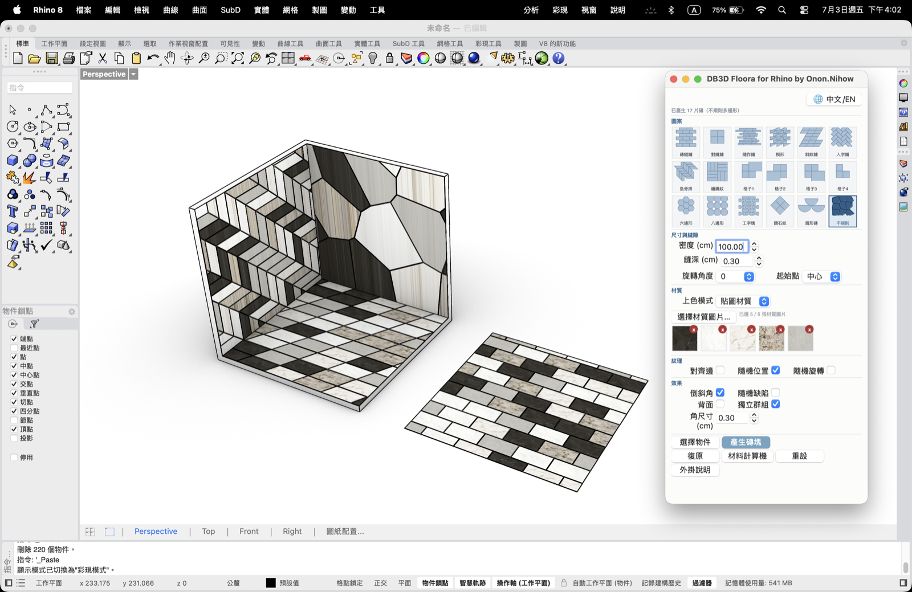

# DB3D-Floora for Rhino

磁磚／地板拼貼圖案產生器與材料計算機——原本是 [DB3D.RENDER](https://www.db3drender.com/) 的 SketchUp 外掛 **DB3D-Floora**，經原作者授權移植為 Rhino 版。

Rhino 版移植：**Onon.Nihow**

## 功能

- **18 種拼貼圖案**：磚縫鋪、對縫鋪、隨作鋪、楔形、斜紋鋪、人字鋪、魚骨拼、編織紋、大小格子 1–4、六邊形、八邊形、工字塊、鑽石紋、扇形磚、不規則多邊形（Voronoi）
- **材質系統**：目前材質／自訂顏色／貼圖材質（最多 5 張圖片），紋理選項（對齊邊、隨機位置、隨機旋轉）
- **效果**：倒斜角、隨機缺陷、背面、獨立群組
- **互動預覽**：選面後滑鼠即時預覽鋪磚位置（純畫面顯示，不產生實際物件），左鍵點擊決定起磚點
- **材料計算機**：統計已產生磚片的圖層面積、依磚片尺寸／耗損率／每箱片數／單價估算所需片數與費用，可匯出 CSV／圖片
- 全繁體中文介面，非模態浮動視窗，永遠置頂於 Rhino 主視窗

## 安裝

1. 到 [Releases](../../releases) 下載最新的 `db3dfloora-<version>-rh8_0-any.yak`（Windows／Mac 通用同一個檔案，Rhino 會自動選對應框架載入）。
2. 把 `.yak` 檔拖進 Rhino 視窗，或用 `PackageManager` 指令手動安裝。
3. **重新啟動 Rhino**（套件安裝不會讓已開著的 Rhino 熱更新）。
4. 指令列輸入 `Floora` 開啟操作介面。

需求：Rhino 8（Windows 或 macOS）。

## 授權與致謝

原始外掛 **DB3D-Floora**（SketchUp 版）由 [DB3D.RENDER](https://www.db3drender.com/)（[Instagram](https://www.instagram.com/db3d.render/)）開發。本專案的 Rhino 移植版已取得原作者授權後公開發布。
